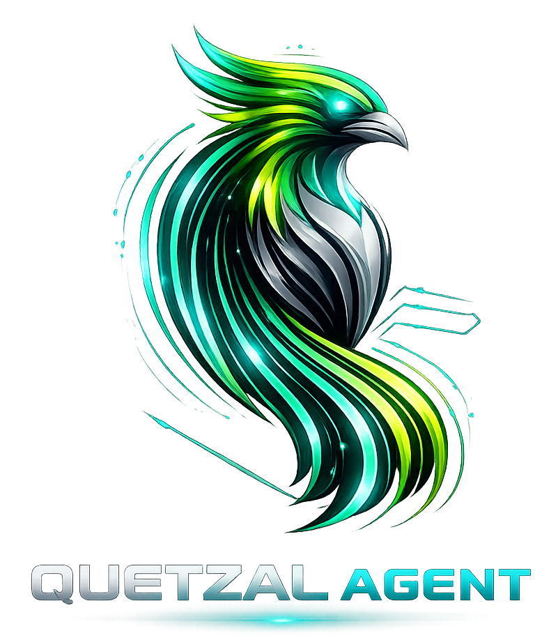

<div align="center">



# 🧠 Quetzal

**AI Architect Agent for OpenCode**

[](https://github.com/RETBOT/ai-agents)
[](https://github.com/RETBOT/ai-agents)
[](https://github.com/Gentleman-Programming/engram)
[](https://context7.com)
[](LICENSE)

*Think before you code. Architect before you build.*

**🚀 Inspired by [Gentleman AI](https://github.com/Gentleman-Programming/gentle-ai)**

</div>

---

## ✨ What is Quetzal?

Quetzal is a **principal architect AI agent** that brings discipline and strategic thinking to your development workflow. Unlike agents that jump straight to implementation, Quetzal:

- 🎯 **Challenges assumptions** — Questions your approach before committing
- 📐 **Designs first** — Architects solutions before writing code
- 🔍 **Reviews critically** — Analyzes and improves existing code
- 🏗️ **Enforces best practices** — SOLID, DRY, KISS are not optional
- 🚀 **Optimizes for scale** — Builds systems that grow gracefully

### Philosophy

> **Code is the last step. Thinking comes first.**

Quetzal doesn't just write code — it helps you build the *right* thing, the *right* way.

---

## 🚀 Quick Start

### One Command (Any Platform)

```bash
git clone https://github.com/RETBOT/ai-agents.git
cd ai-agents
./install.sh
```

This installs the complete ecosystem:
- ✅ **Quetzal Agent** — Your AI architect
- ✅ **Engram** — Persistent memory across sessions
- ✅ **Context7** — Up-to-date library documentation

### Platform-Specific

<details>
<summary>🐧 Linux / macOS / Git Bash</summary>

```bash
./install.sh
```
</details>

<details>
<summary>🪟 Windows PowerShell</summary>

```powershell
# Run directly
.\install.ps1

# Or with bypass (if execution policy blocks)
powershell -ExecutionPolicy Bypass -File install.ps1
```
</details>

<details>
<summary>🔧 Using Make</summary>

```bash
make install          # Auto-detect OS and install everything
make update           # Update all components
make uninstall        # Remove Quetzal
```
</details>

---

## 🧩 Complete Ecosystem

Quetzal comes with a complete AI development ecosystem, inspired by [Gentleman AI](https://github.com/Gentleman-Programming/gentle-ai):

### 🧠 Quetzal Agent
The core architect agent that brings discipline to your coding workflow.

**Features:**
- Three operating modes: PLAN → BUILD → REVIEW
- Challenges decisions before implementation
- Enforces architectural best practices
- Optimizes for scalability and maintainability

### 💾 Engram (Persistent Memory)
[Engram](https://github.com/Gentleman-Programming/engram) remembers decisions, bugs, and context across sessions.

**What it does:**
- Saves architectural decisions automatically
- Remembers bugs and how you fixed them
- Maintains project context across sessions
- Syncs memories via git (share with your team!)

**Commands:**
```bash
engram tui              # Browse memories visually
engram search "auth"    # Find past decisions
engram sync             # Export to git
```

### 📚 Context7 (Library Documentation)
[Context7](https://context7.com) provides up-to-date documentation for any library.

**What it does:**
- Fetches latest docs for React, Next.js, any library
- No more outdated training data
- Code examples from the source
- Works with any version you specify

**How to use:**
Just ask Quetzal anything about a library:
```
"How do I configure Next.js middleware?"
"Show me Supabase auth API examples"
"What's the new React 19 feature?"
```

### 🎯 Skills (Especializaciones)
Quetzal incluye **skills** especializadas que se activan según el contexto:

| Skill | Trigger | Descripción |
|-------|---------|-------------|
| **🔍 code-review** | "Revisa este código" | Revisión de código al estilo arquitecto mexicano |
| **🔨 refactoring** | "Refactoriza esto" | Técnicas de refactorización con ejemplos |
| **📋 sdd** | "Planear feature" | Spec-Driven Development (planear antes de codear) |
| **🧪 testing** | "Haz tests" | Unit, Integration, E2E, TDD |

**Ejemplo:**
```
Usuario: "Revisa este código"
Quetzal: [Activa skill: code-review]
        "🤔 Tiene detalles..."
```

Las skills están en `/skills/` y son personalizables.

---

## 📋 Requirements

| Tool | Required | For | Notes |
|------|----------|-----|-------|
| **Git** | ✅ Yes | All | For cloning and updates |
| **Node.js** | ⚪ Optional | Context7 | `npm install -g @upstash/context7-mcp` |
| **Go** | ⚪ Optional | Engram | Build from source |
| **Bash** | ⚪ Unix | Installer | Git Bash works on Windows |
| **PowerShell** | ⚪ Windows | Alternative | Native Windows support |
| **Make** | ⚪ Optional | Convenience | Auto-detect installer |

### Optional Components

**Without Node.js:** Context7 won't install, but Quetzal works fine  
**Without Go:** Engram won't install, but Quetzal works fine

Both are **optional** — Quetzal functions as a standalone agent.

### Windows Symlinks

- **Option 1:** Run PowerShell as Administrator
- **Option 2:** Enable Developer Mode in Windows Settings
- **Fallback:** Installer automatically copies files if symlinks fail

---

## 🎭 Operating Modes

Quetzal adapts its behavior based on context:

| Mode | Trigger | Behavior |
|------|---------|----------|
| **PLAN** | `plan`, `design`, `architect` | Analyzes, questions, designs solutions |
| **BUILD** | `build`, `implement`, `code` | Implements after approval |
| **REVIEW** | `review`, `analyze`, `improve` | Critiques and improves code |

### Example Interactions

```
User: "Plan an authentication system"
Quetzal [PLAN]: Analyzes requirements, proposes architecture, 
                questions trade-offs before any code

User: "Build the auth module"  
Quetzal [BUILD]: Implements based on approved design

User: "Review this code"
Quetzal [REVIEW]: Analyzes, suggests improvements, flags issues

User: "How do I use React useEffect?"
Quetzal [CONTEXT7]: Fetches latest React docs and explains

User: "Remember we decided to use TypeScript strict"
Quetzal [ENGRAM]: Saves to persistent memory
```

---

## 🏗️ Architecture

```
┌─────────────────────────────────────────────────────────────┐
│                    OpenCode IDE                             │
└─────────────────────────────────────────────────────────────┘
                              │
        ┌─────────────────────┼─────────────────────┐
        │                     │                     │
        ▼                     ▼                     ▼
┌──────────────┐    ┌─────────────────┐    ┌──────────────┐
│   Quetzal    │    │     Engram      │    │   Context7   │
│   Agent      │    │  (Memory)       │    │   (Docs)     │
├──────────────┤    ├─────────────────┤    ├──────────────┤
│ QUETZAL.md   │    │ ~/.engram/      │    │ context7.com │
│ Architect    │    │ SQLite          │    │ MCP Server   │
│ Mentor       │    │ Persistent      │    │ Latest docs  │
└──────────────┘    └─────────────────┘    └──────────────┘
```

### Project Structure

```
ai-agents/
├── quetzal/
│   └── QUETZAL.md              # Agent behavior definition
├── install.sh                  # Unix installer (Bash)
├── install.ps1                 # Windows installer (PowerShell)
├── Makefile                    # Universal installer
├── .engram/                    # Project memory (created on install)
│   └── project.json
└── README.md                   # This file
```

---

## 🔄 Updates

Update everything to latest version:

```bash
# Re-run the installer
./install.sh

# Or using make
make update
```

This will:
- ✅ Pull latest Quetzal changes
- ✅ Update Engram (if installed)
- ✅ Update Context7 (if installed)
- ✅ Refresh all configurations

---

## 🛠️ Troubleshooting

<details>
<summary>❌ "Permission denied" on install.sh</summary>

```bash
chmod +x install.sh
./install.sh
```
</details>

<details>
<summary>❌ "Execution policy" blocks PowerShell</summary>

```powershell
# Temporary bypass
powershell -ExecutionPolicy Bypass -File install.ps1

# Or permanently for CurrentUser
Set-ExecutionPolicy RemoteSigned -Scope CurrentUser
```
</details>

<details>
<summary>⚠️ Context7 not working</summary>

**Install Node.js first:**
- **Windows:** https://nodejs.org/ (LTS version)
- **macOS:** `brew install node`
- **Linux:** `sudo apt install nodejs npm`

Then re-run the installer, or install manually:
```bash
npm install -g @upstash/context7-mcp
```
</details>

<details>
<summary>⚠️ Engram not working</summary>

**Install Go first:**
- All platforms: https://go.dev/dl/

Then re-run the installer, or install manually:
```bash
git clone https://github.com/Gentleman-Programming/engram.git
cd engram && go build -o ~/.local/bin/engram ./cmd/engram
```
</details>

<details>
<summary>❌ Symlink creation fails (Windows)</summary>

**This is normal without Admin/Developer Mode.**

The installer automatically falls back to file copy. Everything works the same.

To enable symlinks:
- Run PowerShell as Administrator, **or**
- Settings → System → For developers → Developer Mode: ON
</details>

<details>
<summary>⚠️ JSON config warnings</summary>

Install `jq` or Python for automatic config management:

**macOS:**
```bash
brew install jq
```

**Ubuntu/Debian:**
```bash
sudo apt install jq
```

**Windows:**
Download from [stedolan.github.io/jq](https://stedolan.github.io/jq/download/)

Or manually edit `~/.opencode/agents.json` — see [Manual Configuration](#-manual-configuration).
</details>

---

## 📝 Manual Configuration

If automatic config fails, add this to `~/.opencode/agents.json`:

```json
{
  "quetzal": {
    "prompt": "{file:./quetzal/QUETZAL.md}",
    "tools": {
      "edit": true,
      "write": true
    },
    "description": "Principal architect and mentor for scalable, maintainable systems",
    "mode": "primary",
    "mcpServers": ["context7", "engram"]
  }
}
```

And add MCP servers to `~/.opencode/mcp/servers.json`:

```json
{
  "mcpServers": {
    "context7": {
      "command": "npx",
      "args": ["-y", "@upstash/context7-mcp@latest"]
    },
    "engram": {
      "command": "engram",
      "args": ["mcp"]
    }
  }
}
```

---

## 🎯 Why Quetzal?

Most AI coding assistants:
- ❌ Jump straight to implementation
- ❌ Don't question your approach
- ❌ Optimize for speed over quality
- ❌ Forget context between sessions
- ❌ Use outdated library docs

Quetzal + Ecosystem:
- ✅ **Thinks before acting** — Architecture first
- ✅ **Challenges you** — Better solutions through questioning
- ✅ **Builds for longevity** — Scalable, maintainable systems
- ✅ **Remembers everything** — Persistent memory with Engram
- ✅ **Always up-to-date** — Latest docs with Context7
- ✅ **Teaches while working** — Explains the "why"

---

## 🌟 Features

- 🚀 **Cross-platform** — Linux, macOS, Windows
- 🔄 **Auto-updating** — Stay current with one command
- 🔗 **Smart linking** — Uses symlinks when possible, copies when needed
- ⚙️ **Zero config** — Works out of the box
- 📦 **Portable** — Same repo works everywhere
- 🧠 **Memory** — Remembers across sessions (Engram)
- 📚 **Knowledge** — Always fresh docs (Context7)
- 🤝 **Inspired by** — Gentleman AI ecosystem

---

## 🤝 Contributing

Found a bug? Have an idea? Contributions welcome!

1. Fork the repository
2. Create your feature branch (`git checkout -b feature/amazing`)
3. Commit your changes (`git commit -m 'Add amazing feature'`)
4. Push to the branch (`git push origin feature/amazing`)
5. Open a Pull Request

---

## 📜 License

MIT License — see [LICENSE](LICENSE) file for details.

---

## 🙏 Acknowledgments

This project is inspired by and compatible with the [Gentleman AI](https://github.com/Gentleman-Programming/gentle-ai) ecosystem:

- **Engram** — Persistent memory system by Gentleman Programming
- **Context7** — Library documentation by Upstash
- **OpenCode** — AI coding agent platform

Named after the [resplendent quetzal](https://en.wikipedia.org/wiki/Resplendent_quetzal) 🦜 — a bird that doesn't settle for ordinary nests.

---

<div align="center">

**[⬆ Back to Top](#-quetzal)**

Made with 💜 by developers who care about craft

</div>
